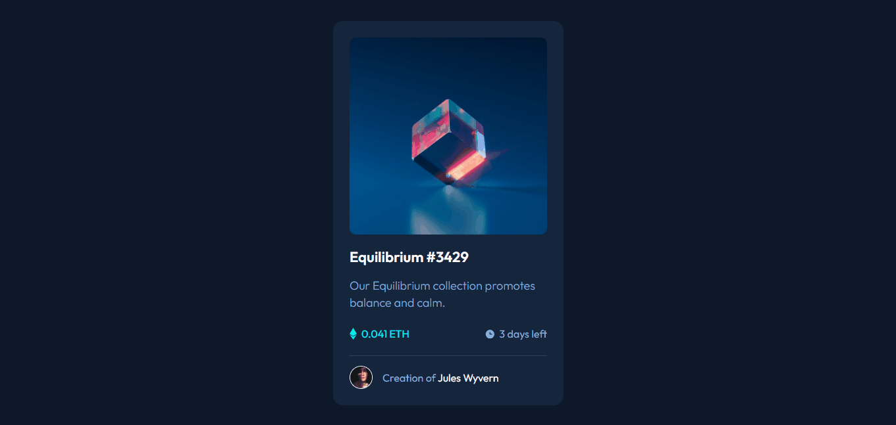

# Projeto NFT Card 📱

Esse projeto é com base no desafio do Frontend - Mentor, seria um layout de um cartão NFT usando display flex:

## Funcionamento do projeto 🔍:

O Layout funciona dessa da seguinte forma temos uma imagem central com um link aonde possui um hover usando transition, possui um titulo com hover também descrição o valor da imagem dias restantes o criador em baixo sem com o nome junto com hover em cima e uma image do criador.

## Tecnologia Utilizadas 🔧:

- HTML;
- CSS;
